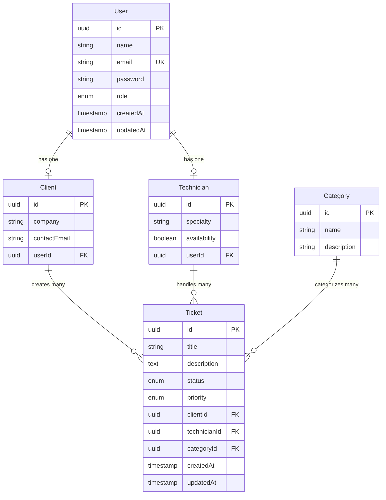

## Entity Overview

The TechHelpDesk API uses TypeORM entities to define the database schema. All entities use UUID primary keys and include automatic timestamp tracking.

## Entity Relationship Diagram



## User Entity

The User entity represents all system users and includes role-based access control.

```typescript src/modules/users/entities/user.entity.ts
import { Entity, PrimaryGeneratedColumn, Column, OneToOne, CreateDateColumn, UpdateDateColumn } from 'typeorm';
import { Client } from './client.entity';
import { Technician } from './technician.entity';

export enum UserRole {
  ADMIN = 'admin',
  TECHNICIAN = 'technician',
  CLIENT = 'client',
}

@Entity('users')
export class User {
  @PrimaryGeneratedColumn('uuid')
  id: string;

  @Column()
  name: string;

  @Column({ unique: true })
  email: string;

  @Column({ select: false })
  password: string;

  @Column({ type: 'enum', enum: UserRole, default: UserRole.CLIENT })
  role: UserRole;

  @OneToOne(() => Client, (client) => client.user, { nullable: true })
  clientProfile: Client;

  @OneToOne(() => Technician, (technician) => technician.user, { nullable: true })
  technicianProfile: Technician;

  @CreateDateColumn()
  createdAt: Date;

  @UpdateDateColumn()
  updatedAt: Date;
}
```

### User Roles

<Tabs>
  <Tab title="ADMIN">
    **Role**: `admin`
    
    Administrators have full system access:
    - Manage all users, tickets, and categories
    - Access all API endpoints
    - Can also have a technician profile
    
    **Example**:
    ```json
    {
      "id": "123e4567-e89b-12d3-a456-426614174000",
      "name": "Administrador",
      "email": "admin@admin.com",
      "role": "admin"
    }
    ```
  </Tab>
  
  <Tab title="TECHNICIAN">
    **Role**: `technician`
    
    Technicians handle support tickets:
    - View and update assigned tickets
    - Change ticket status and priority
    - Must have an associated Technician profile
    
    **Example**:
    ```json
    {
      "id": "123e4567-e89b-12d3-a456-426614174001",
      "name": "Juan Pérez",
      "email": "tech@example.com",
      "role": "technician"
    }
    ```
  </Tab>
  
  <Tab title="CLIENT">
    **Role**: `client`
    
    Clients create and track their tickets:
    - Create new support tickets
    - View their own tickets
    - Update ticket details before assignment
    
    **Example**:
    ```json
    {
      "id": "123e4567-e89b-12d3-a456-426614174002",
      "name": "Usuario de Prueba",
      "email": "user@test.com",
      "role": "client"
    }
    ```
  </Tab>
</Tabs>

### Key Features

<CardGroup cols={2}>
  <Card title="UUID Primary Key" icon="key">
    Uses `uuid` type for globally unique identifiers across distributed systems.
  </Card>
  
  <Card title="Unique Email" icon="at">
    Email addresses must be unique. Used for authentication and user lookup.
  </Card>
  
  <Card title="Password Security" icon="lock">
    Password field has `select: false` to prevent accidental exposure in queries.
  </Card>
  
  <Card title="Role Enum" icon="user-shield">
    Role is enforced at the database level using PostgreSQL enum type.
  </Card>
</CardGroup>

## Client Entity

The Client entity extends user information for customers who create support tickets.

```typescript src/modules/users/entities/client.entity.ts
import { Entity, PrimaryGeneratedColumn, Column, OneToOne, JoinColumn, OneToMany } from 'typeorm';
import { User } from './user.entity';
import { Ticket } from '../../tickets/entities/ticket.entity';

@Entity('clients')
export class Client {
  @PrimaryGeneratedColumn('uuid')
  id: string;

  @Column()
  company: string;

  @Column()
  contactEmail: string;

  @OneToOne(() => User, (user) => user.clientProfile, { onDelete: 'CASCADE' })
  @JoinColumn()
  user: User;

  @OneToMany(() => Ticket, (ticket) => ticket.client)
  tickets: Ticket[]; 
}
```

### Fields

- **id**: UUID primary key
- **company**: Company or organization name
- **contactEmail**: Primary contact email (can differ from user email)
- **user**: One-to-one relationship with User entity
- **tickets**: Collection of all tickets created by this client

<Note>
  The `onDelete: 'CASCADE'` ensures that when a User is deleted, the associated Client profile is automatically removed.
</Note>

## Technician Entity

The Technician entity represents support staff who handle tickets.

```typescript src/modules/users/entities/technician.entity.ts
import { Entity, PrimaryGeneratedColumn, Column, OneToOne, JoinColumn, OneToMany } from 'typeorm';
import { User } from './user.entity';
import { Ticket } from '../../tickets/entities/ticket.entity';

@Entity('technicians')
export class Technician {
  @PrimaryGeneratedColumn('uuid')
  id: string;

  @Column()
  specialty: string;

  @Column({ default: true })
  availability: boolean;

  @OneToOne(() => User, (user) => user.technicianProfile, { onDelete: 'CASCADE' })
  @JoinColumn()
  user: User;

  @OneToMany(() => Ticket, (ticket) => ticket.technician)
  tickets: Ticket[]; 
}
```

### Fields

- **id**: UUID primary key
- **specialty**: Technical specialty (e.g., "Soporte General", "Hardware", "Software")
- **availability**: Boolean flag indicating if technician can accept new tickets
- **user**: One-to-one relationship with User entity
- **tickets**: Collection of all tickets assigned to this technician

<Tip>
  The `availability` field can be used to implement automatic ticket routing to available technicians.
</Tip>

## Ticket Entity

The Ticket entity is the core of the helpdesk system, tracking support requests from creation to resolution.

```typescript src/modules/tickets/entities/ticket.entity.ts
import { Entity, 
    PrimaryGeneratedColumn, 
    Column, CreateDateColumn, 
    UpdateDateColumn, 
    ManyToOne, 
    JoinColumn 
} from 'typeorm';

import { Client } from '../../users/entities/client.entity';
import { Technician } from '../../users/entities/technician.entity';
import { Category } from '../../categories/entities/category.entity';

export enum TicketStatus {
  OPEN = 'open',
  IN_PROGRESS = 'in_progress',
  RESOLVED = 'resolved',
  CLOSED = 'closed',
}

export enum TicketPriority {
  LOW = 'low',
  MEDIUM = 'medium',
  HIGH = 'high',
}

@Entity('tickets')
export class Ticket {
  @PrimaryGeneratedColumn('uuid')
  id: string;

  @Column()
  title: string;

  @Column('text')
  description: string;

  @Column({ type: 'enum', enum: TicketStatus, default: TicketStatus.OPEN })
  status: TicketStatus;

  @Column({ type: 'enum', enum: TicketPriority, default: TicketPriority.MEDIUM })
  priority: TicketPriority;

  // --- RELATIONSHIPS ---

  @ManyToOne(() => Client, (client) => client.tickets, { nullable: false })
  @JoinColumn({ name: 'client_id' })
  client: Client;

  @ManyToOne(() => Technician, (tech) => tech.tickets, { nullable: true })
  @JoinColumn({ name: 'technician_id' })
  technician: Technician;

  @ManyToOne(() => Category, (cat) => cat.tickets, { nullable: false })
  @JoinColumn({ name: 'category_id' })
  category: Category;

  @CreateDateColumn()
  createdAt: Date;

  @UpdateDateColumn()
  updatedAt: Date;
}
```

### Ticket Status

<Steps>
  <Step title="OPEN">
    Initial status when a ticket is created. Waiting for assignment.
  </Step>
  
  <Step title="IN_PROGRESS">
    Ticket has been assigned to a technician and is being worked on.
  </Step>
  
  <Step title="RESOLVED">
    Issue has been resolved but ticket remains open for client verification.
  </Step>
  
  <Step title="CLOSED">
    Ticket is fully closed and archived.
  </Step>
</Steps>

### Ticket Priority

<Tabs>
  <Tab title="LOW">
    **Priority**: `low`
    
    Non-urgent issues that can be addressed when time permits.
    
    Examples:
    - General questions
    - Feature requests
    - Minor UI issues
  </Tab>
  
  <Tab title="MEDIUM">
    **Priority**: `medium`
    
    Default priority. Issues that should be addressed in normal workflow.
    
    Examples:
    - Account access issues
    - Non-critical bugs
    - Configuration help
  </Tab>
  
  <Tab title="HIGH">
    **Priority**: `high`
    
    Urgent issues requiring immediate attention.
    
    Examples:
    - System outages
    - Critical bugs
    - Security issues
  </Tab>
</Tabs>

### Relationships

<CodeGroup>
```typescript Client Relationship
@ManyToOne(() => Client, (client) => client.tickets, { nullable: false })
@JoinColumn({ name: 'client_id' })
client: Client;
```

```typescript Technician Relationship
@ManyToOne(() => Technician, (tech) => tech.tickets, { nullable: true })
@JoinColumn({ name: 'technician_id' })
technician: Technician;
```

```typescript Category Relationship
@ManyToOne(() => Category, (cat) => cat.tickets, { nullable: false })
@JoinColumn({ name: 'category_id' })
category: Category;
```
</CodeGroup>

<Note>
  The `technician` relationship is nullable, allowing tickets to exist without assignment. The `client` and `category` relationships are required.
</Note>

## Category Entity

The Category entity organizes tickets by type or department.

```typescript src/modules/categories/entities/category.entity.ts
import { Entity, PrimaryGeneratedColumn, Column, OneToMany } from 'typeorm';
import { Ticket } from '../../tickets/entities/ticket.entity';

@Entity('categories')
export class Category {
  @PrimaryGeneratedColumn('uuid')
  id: string;

  @Column()
  name: string;

  @Column({ nullable: true })
  description: string;

  @OneToMany(() => Ticket, (ticket) => ticket.category)
  tickets: Ticket[];
}
```

### Fields

- **id**: UUID primary key
- **name**: Category name (e.g., "Soporte Técnico", "Facturación", "Acceso")
- **description**: Optional detailed description of the category
- **tickets**: Collection of all tickets in this category

### Common Categories

<CardGroup cols={3}>
  <Card title="Soporte Técnico" icon="wrench">
    Hardware and software technical issues
  </Card>
  
  <Card title="Facturación" icon="file-invoice-dollar">
    Billing inquiries and payment issues
  </Card>
  
  <Card title="Acceso" icon="key">
    Login and access control problems
  </Card>
</CardGroup>

## Common Decorators

All entities use TypeORM decorators to define schema and relationships:

### Primary Keys

```typescript
@PrimaryGeneratedColumn('uuid')
id: string;
```

Generates UUID primary keys automatically using PostgreSQL's `uuid_generate_v4()` function.

### Relationships

<Tabs>
  <Tab title="OneToOne">
    ```typescript
    @OneToOne(() => User, (user) => user.clientProfile, { onDelete: 'CASCADE' })
    @JoinColumn()
    user: User;
    ```
    
    Defines a one-to-one relationship. The `@JoinColumn()` decorator specifies which side owns the foreign key.
  </Tab>
  
  <Tab title="OneToMany">
    ```typescript
    @OneToMany(() => Ticket, (ticket) => ticket.client)
    tickets: Ticket[];
    ```
    
    Defines the inverse side of a many-to-one relationship. Does not create a foreign key.
  </Tab>
  
  <Tab title="ManyToOne">
    ```typescript
    @ManyToOne(() => Client, (client) => client.tickets, { nullable: false })
    @JoinColumn({ name: 'client_id' })
    client: Client;
    ```
    
    Defines the owning side of a relationship. Creates a foreign key column in the database.
  </Tab>
</Tabs>

### Timestamps

```typescript
@CreateDateColumn()
createdAt: Date;

@UpdateDateColumn()
updatedAt: Date;
```

- **CreateDateColumn**: Automatically set when the record is created
- **UpdateDateColumn**: Automatically updated whenever the record is modified

### Enums

```typescript
@Column({ type: 'enum', enum: TicketStatus, default: TicketStatus.OPEN })
status: TicketStatus;
```

Creates PostgreSQL enum types for type-safe string values.

## Database Constraints

<AccordionGroup>
  <Accordion title="Unique Constraints">
    - **users.email**: Must be unique across all users
    - Enforced at database level with unique index
  </Accordion>
  
  <Accordion title="Foreign Key Constraints">
    - **tickets.client_id**: References clients.id (NOT NULL)
    - **tickets.technician_id**: References technicians.id (NULL allowed)
    - **tickets.category_id**: References categories.id (NOT NULL)
    - **clients.user_id**: References users.id (CASCADE on delete)
    - **technicians.user_id**: References users.id (CASCADE on delete)
  </Accordion>
  
  <Accordion title="Check Constraints">
    - **UserRole**: Must be one of 'admin', 'technician', or 'client'
    - **TicketStatus**: Must be one of 'open', 'in_progress', 'resolved', or 'closed'
    - **TicketPriority**: Must be one of 'low', 'medium', or 'high'
  </Accordion>
</AccordionGroup>

## Query Examples

### Find User with Profiles

```typescript
const user = await userRepository.findOne({
  where: { email: 'admin@admin.com' },
  relations: ['clientProfile', 'technicianProfile'],
});
```

### Find Tickets with Relations

```typescript
const tickets = await ticketRepository.find({
  relations: ['client', 'client.user', 'technician', 'technician.user', 'category'],
  order: { createdAt: 'DESC' },
});
```

### Find Tickets by Status

```typescript
const openTickets = await ticketRepository.find({
  where: { status: TicketStatus.OPEN },
  relations: ['category', 'client'],
});
```

## Next Steps

<CardGroup cols={2}>
  <Card title="Database Migrations" icon="database" href="/database/migrations">
    Learn how to create and run migrations for schema changes
  </Card>
  <Card title="API Endpoints" icon="code" href="/api/tickets/overview">
    Explore the REST API endpoints for working with these entities
  </Card>
</CardGroup>
